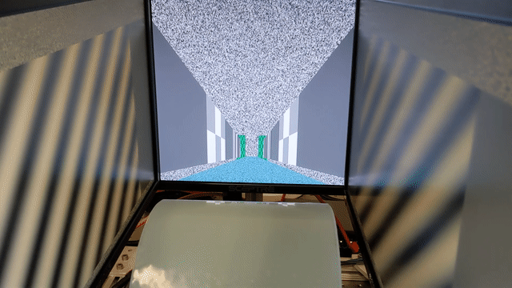

# PyRenderMaze

(C) 2021 by Jiwon Kim and Caleb Kemere

PyRenderMaze is inspired by our search for a simple, Python-based first-person 3D maze rendering platform for neuroscience
experiments. In particular, we make the design decision that the task of the code is soley to **render** the environment, 
not to interact with user  feedback, etc. This allows the code to be lightweight enough run on low-powered hardware, such 
as a Raspberry Pi 4B (which can render full-screen video at 60 FPS).  Following the theme of minimal weight, we use YAML 
configuration files for 3D environments and viewport size/perspective/geometry. Once a PyRenderMaze instance is configured, 
it listens for 3D posiiton updates received from a  [ZMQ PUB/SUB stream](https://learning-0mq-with-pyzmq.readthedocs.io/en/latest/pyzmq/patterns/pubsub.html).

This program is designed to run in concert with the [https://github.com/kemerelab/TreadmillIO] project, which includes
a hardware interface to a cylindrical treadmill as well as real-time virtual-position-based control of dynamic auditory
stimuli. However, as PyRenderMaze runs as a separate process, or indeed, even on separate computers, it can be used independetly. 

## Quick start
To test, begin by cloning the repository, and ensuring that you have all needed packages (i.e., `pandas3d pyzmq pyyaml`) installed. 
+ Run `git clone https://github.com/kemerelab/PyRenderMaze`
+ Install Panda3D [Windows](https://docs.panda3d.org/1.10/python/introduction/installation-windows) or 
   [Linux](https://docs.panda3d.org/1.10/python/introduction/installation-linux). See notes below for gists describing the installation process for Raspberry Pi. 
+ Install other dependencies `/usr/bin/pip3 install pyzmq pyyaml` (note that if you are an Anaconda user, the packaged Panad3D may not be installed in your default conda environment! Using the system python3 and pip3 alleviates this concern.)
+ You should then be able to run the program with `/usr/bin/python3 main.py`. Note that the file `display_config.yaml` contains
  the size of the display and the relative geometry of the eye position. You should edit this file in each PyRenderMaze client
  such that each display renders properly.

_When PyRenderMaze starts, it displays a simple screen that reports the IP address that it is listening on for configuration.
This simplifies use with headless devices such as the Pi!_

+ To actually see an environment, the next step is to configure the PyRenderMaze client(s). The script in `configure_remotes.py`
  gives an example where 3 different PyRenderMaze clients (i.e., straight ahead, left and right) are configured to display a 
  maze and listen to the proper port. 
  
+ To simulate the position stream input, you can use the `send_position.py` script. Make sure that the port/IP information you've
  configured in the previous step matches what is in this file!

Notes:
+ gist about compiling Panda3D for Raspberry Pi / Ubuntu: [https://gist.github.com/ckemere/c862155111f929ad35f5c7eb0024143f] 

TODO:
+ **Improve Demo**
